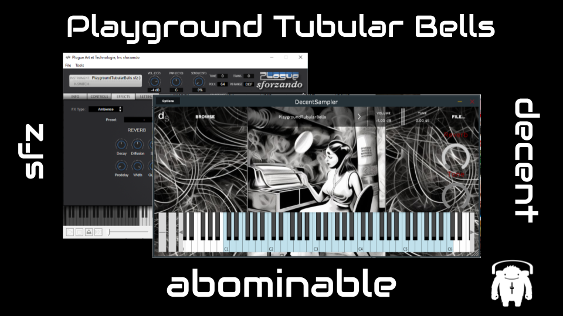

# abominable Instruments

### A repo for my sample instruments, usually in both SFZ and decentSampler format

## Brassando
#### A sampled euphoium, trumpet, and combined euphonium + trumpet patch in SFZ and decentSampler format. The euphonium is gloriously wobbly in pitch (blame the operator...)
[Brassando zip file download](https://github.com/drmarkreuter/abominableInstruments/blob/main/Brassando.zip)

## Playground Tubular Bells
#### Made from a tubular bell toy found in a playground in the city and recorded on a cold Sunday morning. Provided in SFZ and decentSampler formats. 
[Playground Tubular Bells zip file download](https://github.com/drmarkreuter/abominableInstruments/blob/main/Playground_TubularBells.zip)

---
