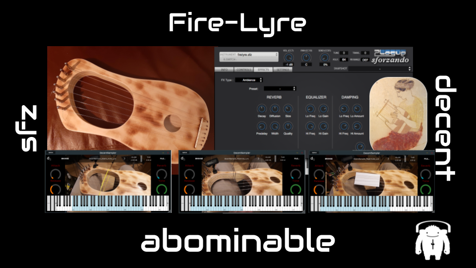
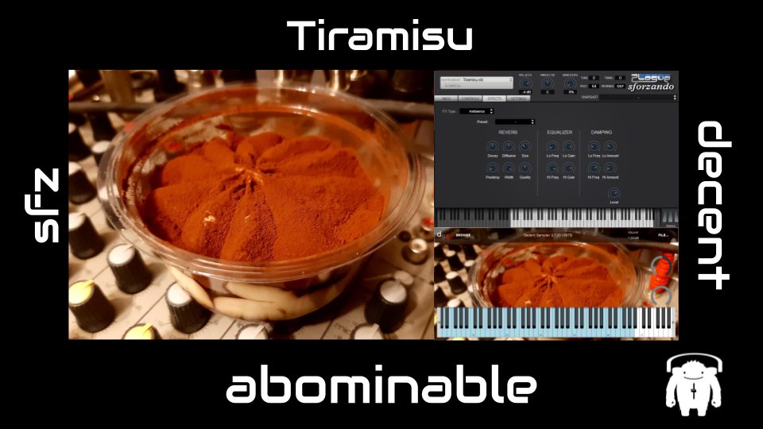

# abominable Instruments

### A repo for my sample instruments, usually in both SFZ and decentSampler format

See [here](https://drmarkreuter.github.io/abominableInstruments/) for website with demos

## Brassando
#### A sampled euphoium, trumpet, and combined euphonium + trumpet patch in SFZ and decentSampler format. The euphonium is gloriously wobbly in pitch (blame the operator...)
[Brassando zip file download](https://github.com/drmarkreuter/abominableInstruments/blob/main/Brassando.zip)

## Electro-mechanial Noise
#### A sample instrument based on recording a cassette mechanism from a Sony Walkman through a modular synth.
[Electro-mechanical Noise zip file download]()

## Fire-Lyre
#### A sampled kit lyre played a few different ways...
[Fire lyre zip file download](https://github.com/drmarkreuter/abominableInstruments/blob/main/Fire-lyre.zip)

## Halfsize Nylon
#### An old halfsize nylon string guitar I found in a flea market, cleaned-up and sampled
[Fire lyre zip file download](https://github.com/drmarkreuter/abominableInstruments/blob/main/Halfsize_Nylon.zip)

## Toy Piano
#### A lovely wooden toy piano, sampling each note, with extended mapping across the entire keyboard. Provided in SFZ and decentSampler formats.
[Toy Piano zip file download](https://github.com/drmarkreuter/abominableInstruments/blob/main/Toy%20Piano.zip)

## Playground Tubular Bells
#### Made from a tubular bell toy found in a playground in the city and recorded on a cold Sunday morning. Provided in SFZ and decentSampler formats. 
[Playground Tubular Bells zip file download](https://github.com/drmarkreuter/abominableInstruments/blob/main/Playground_TubularBells.zip)

## Nightsky Kalimba
#### In expensive Kalimba recorded through the Stymon Nightsky reverb pedal. Provided in SFZ and decentSampler format.
[Nightsky Kalimba zip file download](https://github.com/drmarkreuter/abominableInstruments/blob/main/Nightsky_Kalimba.zip)

## Typewriter
#### In made this instrument for a live track about a haunted typewriter. Use as an alternative percussion instrument!
[Typewriter zip file download](https://github.com/drmarkreuter/abominableInstruments/blob/main/Typewriter.zip)

## Holesaw Idiophone
#### A humble homemade ideophone made from holesaws!
[Holesaw Idiophone zip file download](https://github.com/drmarkreuter/abominableInstruments/blob/main/Holesaw_Idiophone.zip)

## Tiramisu
#### A percussion instrument based on a Tiramisu pot. It was delicious...
[Tiramisu zip file download](https://github.com/drmarkreuter/abominableInstruments/blob/main/Tiramisu.zip)

## Mystic Beats
#### Some bleeps and bloops from the Mystic drone synth from Recovery Effects
[Mystic beats zip file download](https://github.com/drmarkreuter/abominableInstruments/blob/main/Mystic_Beats.zip)

---
